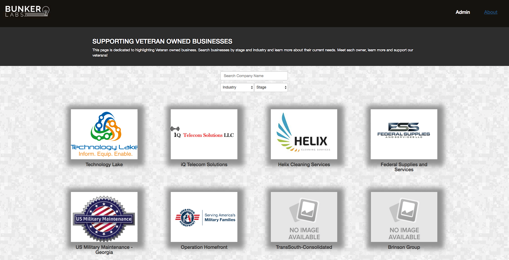

## BunkerLabs Marketplace

## <a href=""> BunkerLabs Marketplace Demo</a>

BunkerLabs Marketplace represents not only the capstone project for Digital Crafts, for which the team members employed their development skills learned during the duration of the cohort, but also a platform the veterans seeking support when starting a business, can use to help in their journey.

## Team Members
* <a href="https://github.com/stephenjarrett"> Stephen Jarrett</a>
* <a href="https://github.com/sprice36"> Sebastian Price</a>
* <a href="https://github.com/Dsande41"> Delia Sanders</a>
* <a href="https://github.com/Dmckinney821"> Daniel McKinney</a>

## Technologies Used
* HTML5
* CSS3
* React
* Node.js
* MongoDB
* Express

## Site walkthrough 
The BunkerLabs Marketplace Atlanta website serves as a launching platform for veterans to present their startup businesses and elicit support in order to have a healthy growth and be successful in a competitive market.

### Landing Page
The Landing Page displays the Logo of the companies and their names.The user can search a company by name and sort by industry type and stage of the bussiness. After all the previous steps are executed, the user is presented with a grid of logos that match the desired criterias.

### Company Detail Page
The user can click on the desired Company Logo and it will be redirected to a Company Detail Page where one can find more information about the startup that peek their interest.The extra information provided on this page ranges from company logo and name, to the  image of the company owner, and a link to the website.Also, the top three needs of the business are displayed and the social network addresses for the respective company.

### Admin Page
The Admin Page has two main components: the Admin Panel Login Page and the Admin Home Panel Page. The Admin Page was created having both security and ease of use when entering, editing or deleting a company information.

#### Admin Panel Login Page
On the Admin Panel Login Page, the administrator has to enter a username and password to be granted access to the Admin Home Panel.

#### Admin Home Panel Page
Once granted login priviledges, the administrator can access the Admin Home Panel Page and choose from a dropdown the company desired to be added in the application or update some content or be removed from the database.

## About Page
In the About Page, when the user clicks the dropdown menu and it selects About Bunker Labs Marketplace it will be redirected to the page containing information about what Bunker Labs Marketplace is and why there was a need for it.

## Challeges

## Phase Two
Future iterations of this application will be able to have a user login page for the company owner so they can upload pertinent information about their startup, edit their accounts as the business evolves and even delete it if the so desire.

