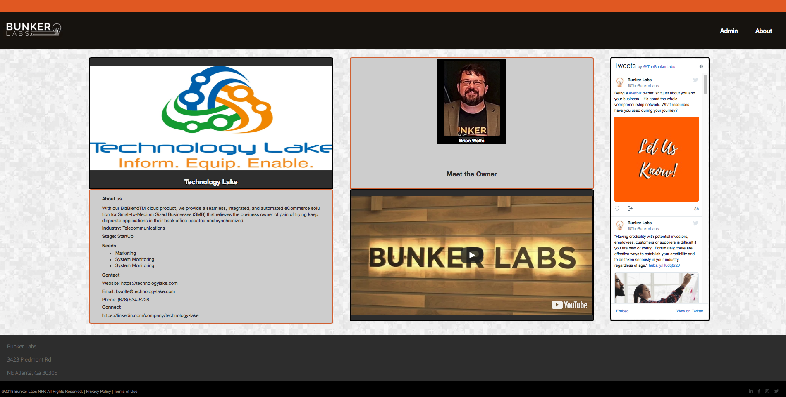
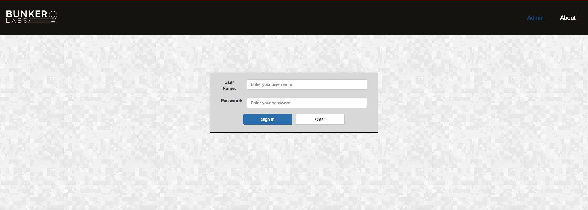
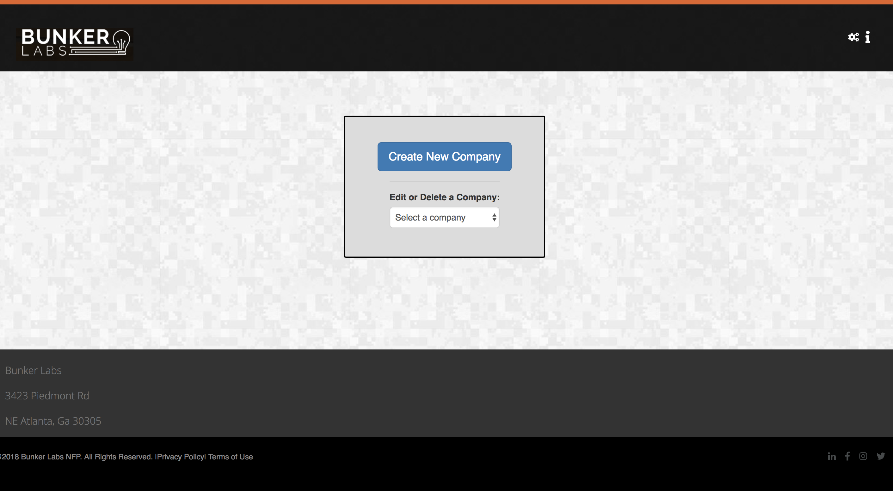
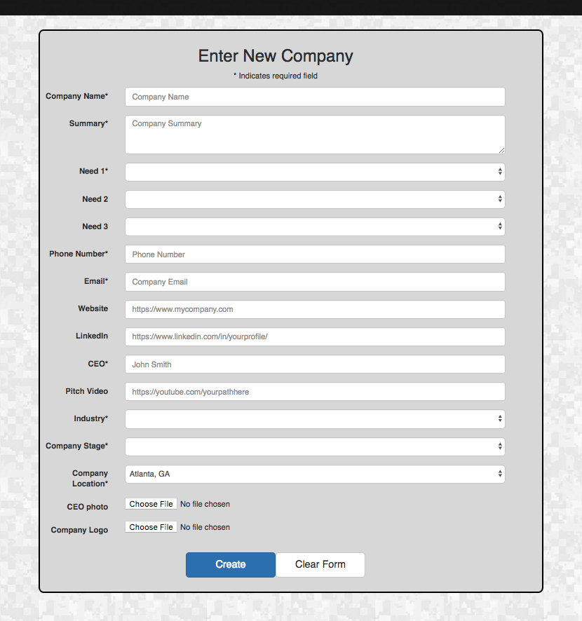
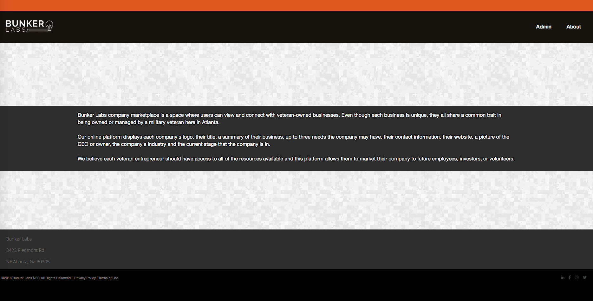

## BunkerLabs Atlanta

## <a href=""> BunkerLabs Atlanta Demo</a>

BunkerLabs Atlanta Marketplace represents the Capstone project for the DigitalCrafts team members. The members listed below used all of the skills and languages learned over the 16 week bootcamp to build an application for a business located in the Atlanta Tech Village. The platform allows veterans to illustrate their entrepreneurial endeavors and showcase what needs they may have in bringing their ideas into fruition.

## Team Members
* <a href="https://github.com/stephenjarrett"> Stephen Jarrett</a>
* <a href="https://github.com/sprice36"> Sebastian Price</a>
* <a href="https://github.com/Dsande41"> Delia Sanders</a>
* <a href="https://github.com/Dmckinney821"> Daniel McKinney</a>

## Technologies Used
* HTML5
* CSS3
* React
* Node.js
* MongoDB
* Express
* Robo3T/ MongoCompass
* Postman
* JavaScript

## Site walkthrough 
BunkerLabs Atlanta serves as a launching platform for veterans to present their startup businesses and elicit support in order to have healthy growth and be successful in a competitive market.

### Landing Page
The Landing Page displays the different companies currently featured. The user can search for different companies to help or engage. The user can choose a company and they are displayed the companies details and a "pitch" video to help illustrate the ideals.

### Company Detail Page
The user can click on the Company Logo and it will be redirected to a Company Detail Page. On this page, one can find more information about the startup ranging from logo, the entrepreneur, or current stage of maturation. The top three needs of the business are displayed and the social network addresses for the companies are available to link up.

### Admin Page
The Admin Page has two main components: the Admin Panel Login Page and the Admin Home Panel Page. The Admin Page is secure and a valid log in is necessary . Once logged in, the admin can enter the companies valid information. They can edit the information as the business needs change and the company moves towards critical mass. 

#### Admin Panel Login Page
On the Admin Panel Login Page, the admin must enter a valid username and password to be granted access to the Admin Home Panel. Once validated, the Admin can access the necessary pages to edit or delete company data.

#### Admin Home Panel Page
Once granted login priviledges, the administrator can access the Admin Home Panel Page and choose from a dropdown to perform tasks such as: add a new company, update an existing  or removal from the database.

Only "create a new company" will be displayed as an option on this page to eliminate any mistakes in updating companies. 

          

## About Page 
The About Bunker Labs, displayed as an icon, redirects the user to a new page that explains the purpose of this application, its intended users and outcome.

## Challenges
* We initially met with the product owner to discuss the layout, functionality, & MVP for the project. We 'whiteboarded' and created user stories to help facilitate the development process. We were able to create the MVP and add some additional functionality. The project had a deadline which made it difficult to add all of the future concepts that we laid out. 
* Using Json Web Tokens for server authentification of admin login was a new concept we tackled for this project. It was challenging but was a learning experience for a valuable skill in authentication.
* We wanted to ensure that stored personal information is safe We obtained a SSL Certification using Linode and CertBot. This process was a new task for all team members. 
Some the steps involed are:
  * The stakeholder purchasing a domain so we can point it at the IP address hosted on Linode. 
  * For the documentation of the process, in order to automatically enable HTTPS on the website, CertBot was used.
  * Edit the root and SSH profiles to point the domain at the right IP address.
  * Editing the index.js and removing some of the functionality like "ServiceWorker" to create a smooth user experience. 

## Phase Two
Future iterations of this application should include:
  * A user login page 
  * The company owner can upload or edit relevant information about their startup.
  * Adding paypal links so the user can contribute to the success of the business.
  * Allowing the user to upload videos remotely to display successful ventures. 

